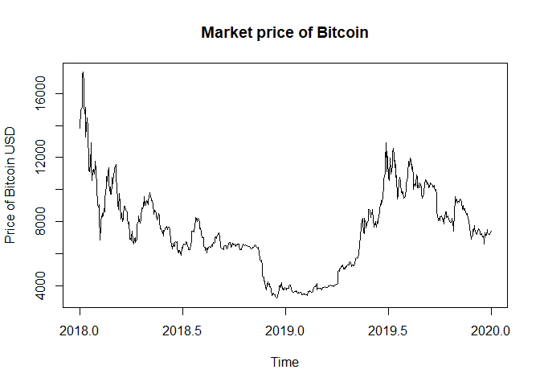
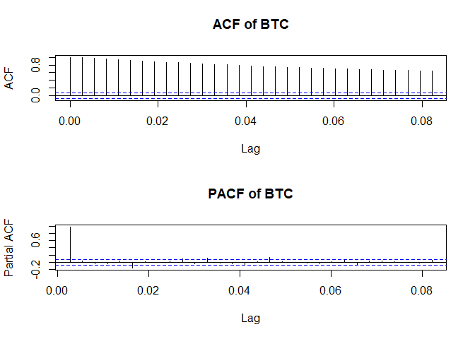
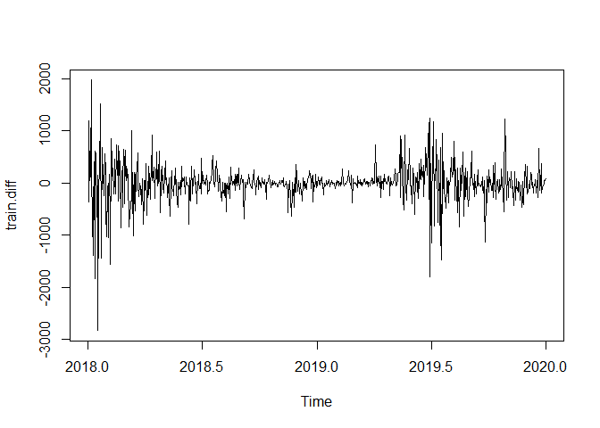
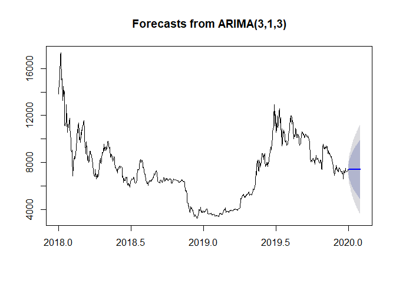
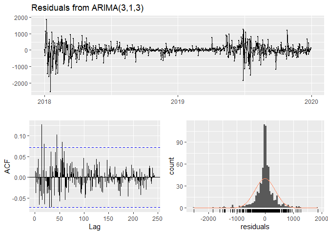
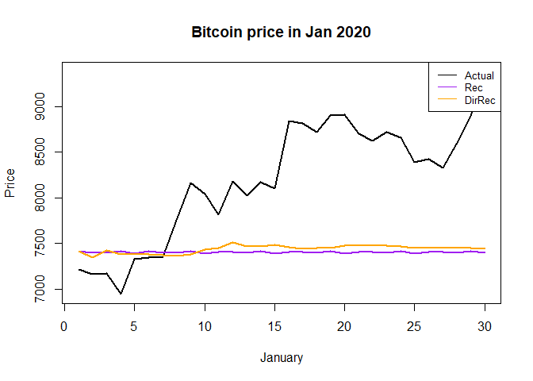
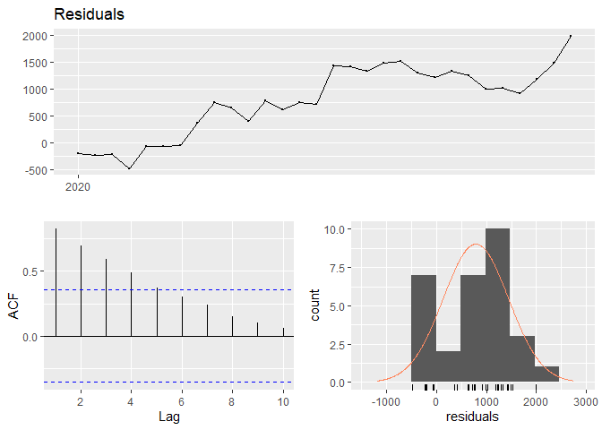
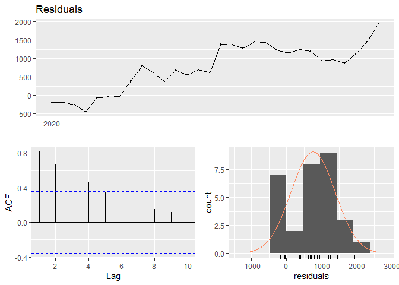

Time Series Project - Exploratory Analysis
================
Jainam Mehta
16 May 2020

Import necessary libraries

``` r
library(tseries)
library(forecast)
```

## Data Prep

Read in the data

``` r
library(Quandl)
Quandl.api_key("UqYbx-p5DwWzyT8AH2c7")
marketpriceUSD<-Quandl("BCHAIN/MKPRU")
```

Reverse the series to get prices in chronological order

``` r
chron <- rev(marketpriceUSD$Value)
c(start = tail(marketpriceUSD$Date, 1), end = head(marketpriceUSD$Date, 1))
```

    ##        start          end 
    ## "2009-01-03" "2020-06-12"

Take log of series and convert to time series object

``` r
BTC <- ts(chron, start = c(2009, 1, 3), frequency = 365)

# focus on 2018 onwards
train <- window(BTC, start = c(2018,1), end  = c(2019,365))
test <- window(BTC, start = c(2020, 1), end = c(2020, 30))
```

Plot the data and run tests for stationarity

``` r
plot(train, ylab = 'Price of Bitcoin USD', main = 'Market price of Bitcoin')
```

<!-- -->

``` r
par(mfrow=c(2, 1))
acf(train, lag = 30, main = 'ACF of BTC')
pacf(train, lag = 30, main = 'PACF of BTC')
```

<!-- -->

``` r
adf.test(train)
```

    ## 
    ##  Augmented Dickey-Fuller Test
    ## 
    ## data:  train
    ## Dickey-Fuller = -3.3539, Lag order = 8, p-value = 0.06138
    ## alternative hypothesis: stationary

``` r
kpss.test(train)
```

    ## Warning in kpss.test(train): p-value smaller than printed p-value

    ## 
    ##  KPSS Test for Level Stationarity
    ## 
    ## data:  train
    ## KPSS Level = 1.7041, Truncation lag parameter = 6, p-value = 0.01

The plot, along with both ADF and KPSS tests suggest that the series is
definitely non-stationary.

Take first differences to see if the series can be made stationary

``` r
train.diff <- diff(train, lag = 1)
plot(train.diff)
```

<!-- -->

``` r
adf.test(train.diff)
```

    ## Warning in adf.test(train.diff): p-value smaller than printed p-value

    ## 
    ##  Augmented Dickey-Fuller Test
    ## 
    ## data:  train.diff
    ## Dickey-Fuller = -9.4113, Lag order = 8, p-value = 0.01
    ## alternative hypothesis: stationary

``` r
kpss.test(train.diff)
```

    ## Warning in kpss.test(train.diff): p-value greater than printed p-value

    ## 
    ##  KPSS Test for Level Stationarity
    ## 
    ## data:  train.diff
    ## KPSS Level = 0.2344, Truncation lag parameter = 6, p-value = 0.1

Taking a difference with lag = 1 seems to make the series stationary.

## Model Fitting

Fit an ARIMA model using auto.arima() function

``` r
(fit <- auto.arima(train, allowdrift = T))
```

    ## Warning: The chosen seasonal unit root test encountered an error when testing for the first difference.
    ## From stl(): series is not periodic or has less than two periods
    ## 0 seasonal differences will be used. Consider using a different unit root test.

    ## Series: train 
    ## ARIMA(3,1,3) 
    ## 
    ## Coefficients:

    ## Warning in sqrt(diag(x$var.coef)): NaNs produced

    ##           ar1      ar2     ar3     ma1     ma2      ma3
    ##       -1.0274  -0.0857  0.5389  1.0005  0.0642  -0.4969
    ## s.e.      NaN      NaN     NaN     NaN     NaN      NaN
    ## 
    ## sigma^2 estimated as 126469:  log likelihood=-5313.74
    ## AIC=10641.49   AICc=10641.64   BIC=10673.63

``` r
forecast <- forecast(fit, h=30)
plot(forecast)
```

<!-- -->

Check residuals on training data

``` r
checkresiduals(fit)
```

<!-- -->

    ## 
    ##  Ljung-Box test
    ## 
    ## data:  Residuals from ARIMA(3,1,3)
    ## Q* = 123.15, df = 140, p-value = 0.8439
    ## 
    ## Model df: 6.   Total lags used: 146

DirRec method of forecasting

``` r
train.append <- train
dirrec.forecast <- c()
dirrec.model <- list()

for (i in 1:30) {
  model <- auto.arima(train.append)
  dirrec.model[[i]] <- model
  f <- forecast(model, h = 1)$mean
  dirrec.forecast <- c(dirrec.forecast, f)
  train.append <- ts(c(train.append, f), start = c(1975, 1), frequency = 12)
}
```

    ## Warning: The chosen seasonal unit root test encountered an error when testing for the first difference.
    ## From stl(): series is not periodic or has less than two periods
    ## 0 seasonal differences will be used. Consider using a different unit root test.

Compare the Recursive and DirRec forecasts

``` r
plot(1:30, test[1:30], type = 'l', lwd = 2,
     main = 'Bitcoin price in Jan 2020',
     xlab = 'January', ylab = 'Price')
lines(1:30, forecast$mean[1:30], type = 'l', lwd = 2, col = 'purple')
lines(1:30, dirrec.forecast, type = 'l', lwd = 2, col = 'orange')
legend("topright", legend=c("Actual", "Rec", "DirRec"),
       col=c("black", "purple", "orange"), lty=1, cex=0.8)
```

<!-- -->

``` r
#forecast$mean[1:30]
#dirrec.forecast
```

Calculate errors and metrics

``` r
library(TSPred)
```

    ## Warning: package 'TSPred' was built under R version 3.6.3

``` r
# Recurive method
errors <- test - forecast$mean[1:30]
checkresiduals(errors)
```

    ## Warning in modeldf.default(object): Could not find appropriate degrees of
    ## freedom for this model.

<!-- -->

``` r
accuracy(test, forecast$mean[1:30])
```

    ##                 ME     RMSE      MAE       MPE     MAPE
    ## Test set -786.4893 1015.834 873.1777 -10.62281 11.79298

``` r
sMAPE(test, forecast$mean[1:30])
```

    ## [1] 0.109517

``` r
# DirRec method
errors <- test - dirrec.forecast
checkresiduals(errors)
```

    ## Warning in modeldf.default(object): Could not find appropriate degrees of
    ## freedom for this model.

<!-- -->

``` r
accuracy(test, dirrec.forecast)
```

    ##                 ME     RMSE      MAE       MPE     MAPE
    ## Test set -752.6867 972.6336 831.0772 -10.09098 11.15155

``` r
sMAPE(test, dirrec.forecast)
```

    ## [1] 0.1038788
