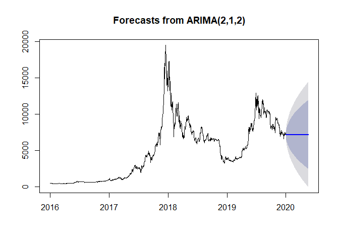
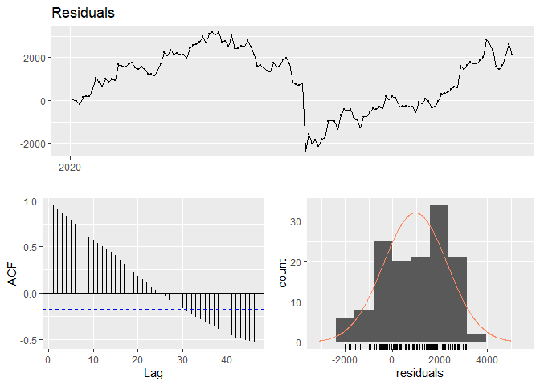
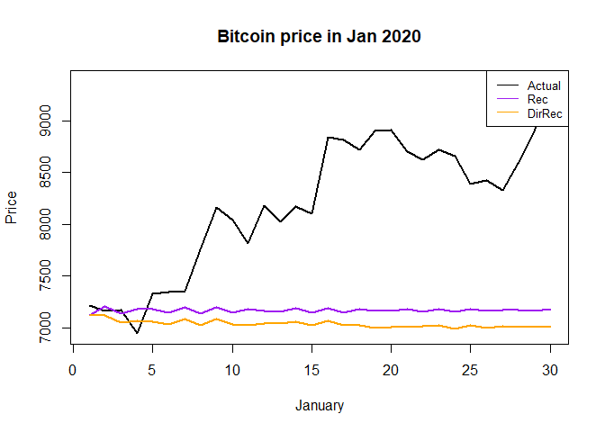

Time Series Project - Exploratory Analysis
================
Jainam Mehta
16 May 2020

Import necessary libraries

``` r
library(tseries)
library(forecast)
```

## Data Prep

Read in the data

``` r
library(Quandl)
Quandl.api_key("UqYbx-p5DwWzyT8AH2c7")
marketpriceUSD<-Quandl("BCHAIN/MKPRU")
```

Reverse the series to get prices in chronological order

``` r
chron <- rev(marketpriceUSD$Value)
c(start = tail(marketpriceUSD$Date, 1), end = head(marketpriceUSD$Date, 1))
```

    ##        start          end 
    ## "2009-01-03" "2020-05-17"

Covert to time series object

``` r
BTC <- ts(chron, start = c(2009, 1, 3), frequency = 365)

# focus on 2016 onwards
train <- window(BTC, start = 2016, end  = 2020)
test <- window(BTC, start = 2020)
```

Plot the data and run tests for stationarity

``` r
plot(train)
```

<!-- -->

``` r
acf(train); pacf(train)
```

<!-- --><!-- -->

``` r
adf.test(train)
```

    ## 
    ##  Augmented Dickey-Fuller Test
    ## 
    ## data:  train
    ## Dickey-Fuller = -2.5302, Lag order = 11, p-value = 0.3539
    ## alternative hypothesis: stationary

``` r
kpss.test(train)
```

    ## Warning in kpss.test(train): p-value smaller than printed p-value

    ## 
    ##  KPSS Test for Level Stationarity
    ## 
    ## data:  train
    ## KPSS Level = 10.082, Truncation lag parameter = 7, p-value = 0.01

The plot, along with both ADF and KPSS tests suggest that the series is
definitely non-stationary.

Take first differences to see if the series can be made stationary

``` r
train.diff <- diff(train, lag = 1)
plot(train.diff)
```

<!-- -->

``` r
adf.test(train.diff)
```

    ## Warning in adf.test(train.diff): p-value smaller than printed p-value

    ## 
    ##  Augmented Dickey-Fuller Test
    ## 
    ## data:  train.diff
    ## Dickey-Fuller = -9.8936, Lag order = 11, p-value = 0.01
    ## alternative hypothesis: stationary

``` r
kpss.test(train.diff)
```

    ## Warning in kpss.test(train.diff): p-value greater than printed p-value

    ## 
    ##  KPSS Test for Level Stationarity
    ## 
    ## data:  train.diff
    ## KPSS Level = 0.063532, Truncation lag parameter = 7, p-value = 0.1

Taking a difference with lag = 1 seems to make the series stationary.

## Model Fitting

Fit an ARIMA model using auto.arima() function

``` r
(fit <- auto.arima(train, allowdrift = T))
```

    ## Series: train 
    ## ARIMA(2,1,2) 
    ## 
    ## Coefficients:
    ##           ar1      ar2     ma1     ma2
    ##       -1.7403  -0.9056  1.8016  0.9418
    ## s.e.   0.0264   0.0223  0.0247  0.0221
    ## 
    ## sigma^2 estimated as 93342:  log likelihood=-10424.03
    ## AIC=20858.07   AICc=20858.11   BIC=20884.5

``` r
forecast <- forecast(fit, h=138)
plot(forecast)
```

<!-- -->

Check residuals

``` r
residuals <- test - forecast$mean
mean(residuals)
```

    ## [1] 959.8261

``` r
checkresiduals(residuals)
```

    ## Warning in modeldf.default(object): Could not find appropriate degrees of
    ## freedom for this model.

<!-- -->

DirRec method of forecasting

``` r
train.append <- train
dirrec.forecast <- c()
dirrec.model <- list()

for (i in 1:30) {
  model <- auto.arima(train.append)
  dirrec.model[[i]] <- model
  f <- forecast(model, h = 1)$mean
  dirrec.forecast <- c(dirrec.forecast, f)
  train.append <- ts(c(train.append, f), start = c(1975, 1), frequency = 12)
}
```

Compare the Recursive and DirRec forecasts

``` r
plot(1:30, test[1:30], type = 'l', lwd = 2,
     main = 'Bitcoin price in Jan 2020',
     xlab = 'January', ylab = 'Price')
lines(1:30, forecast$mean[1:30], type = 'l', lwd = 2, col = 'purple')
lines(1:30, dirrec.forecast, type = 'l', lwd = 2, col = 'orange')
legend("topright", legend=c("Actual", "Rec", "DirRec"),
       col=c("black", "purple", "orange"), lty=1, cex=0.8)
```

<!-- -->

``` r
#forecast$mean[1:30]
#dirrec.forecast
```
