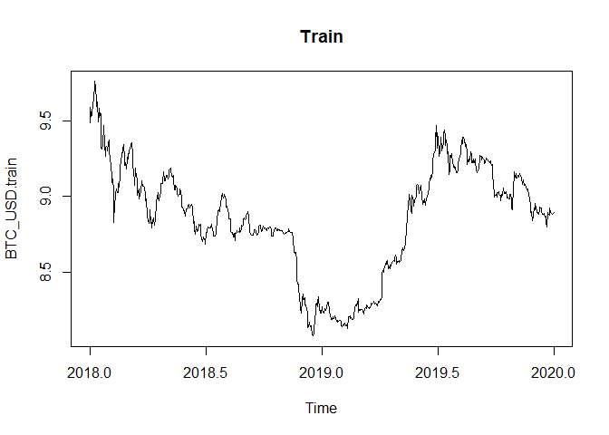
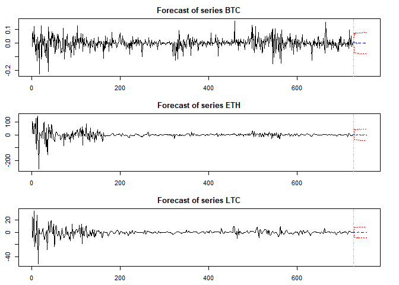

Time Series Project - Multivariate Analysis
================
Jainam Mehta
02 June 2020

Import necessary libraries

``` r
library(tseries)
library(forecast)
library(tidyverse)
library(MTS)
library(imputeTS)
library(TSA)
library(lubridate)
library(vars)
```

## Data Prep

Download various datasets from Quandl

  - BTC Market price
    (<https://www.quandl.com/data/BCHAIN/MKPRU-Bitcoin-Market-Price-USD>)
  - ETH to USD rate
    (<https://www.quandl.com/data/GDAX/ETH_USD-ETH-USD-Exchange-Rate>)
  - LTC to USD rate
    (<https://www.quandl.com/data/GDAX/LTC_USD-LTC-USD-Exchange-Rate>)
  - ETH to BTC rate
    (<https://www.quandl.com/data/GDAX/ETH_BTC-ETH-BTC-Exchange-Rate>)
  - LTC to BTC rate
    (<https://www.quandl.com/data/GDAX/LTC_BTC-LTC-BTC-Exchange-Rate>)
  - Bitcoin Miners Revenue
    (<https://www.quandl.com/data/BCHAIN/MIREV-Bitcoin-Miners-Revenue>)
  - Number of Transactions
    (<https://www.quandl.com/data/BCHAIN/NTRAN-Bitcoin-Number-of-Transactions>)

<!-- end list -->

``` r
library(Quandl)
Quandl.api_key("UqYbx-p5DwWzyT8AH2c7")

# Select the relevant series
BTC_USD_raw<-Quandl("BCHAIN/MKPRU")
ETH_USD_raw<-Quandl("GDAX/ETH_USD")
LTC_USD_raw<-Quandl("GDAX/LTC_USD")
ETH_BTC_raw<-Quandl("GDAX/ETH_BTC")
LTC_BTC_raw<-Quandl("GDAX/LTC_BTC")

# Select non-price predictors
MIREV_raw<-Quandl("BCHAIN/MIREV")
NTRAN_raw<-Quandl("BCHAIN/NTRAN")
```

Create a function to convert the data into proper time series objects.
This function reverses the time series so that it is chrononlogical and
then assigns it to a time series object with the correct start date.

``` r
create_ts <- function(rawdata) {
  # use opening price, if Value column doesn't exist
  if (!"Value" %in% colnames(rawdata)) {rawdata$Value <- rawdata$Open} 
  
  rawdata$Date <- as.Date(rawdata$Date)
  # fill missing dates with NA.
  rawdata <- complete(rawdata, Date = seq(min(Date), max(Date), by = "day")) 
  #year <- as.numeric(format(rawdata$Date,'%Y'))[1]
  #month <- as.numeric(format(rawdata$Date,'%m'))[1]
  #day <- as.numeric(format(rawdata$Date,'%d'))[1]
  
  return(ts(rawdata$Value, decimal_date(as.Date(rawdata$Date[1])), frequency = 365))
}
```

Create time series objects for all data

``` r
BTC_USD <- create_ts(BTC_USD_raw)
plot(BTC_USD)
```

<!-- -->

``` r
ETH_USD <- create_ts(ETH_USD_raw)
plot(ETH_USD)
```

<!-- -->

``` r
LTC_USD <- create_ts(LTC_USD_raw)
plot(LTC_USD)
```

<!-- -->

``` r
ETH_BTC <- create_ts(ETH_BTC_raw)
plot(ETH_BTC)
```

<!-- -->

``` r
LTC_BTC <- create_ts(LTC_BTC_raw)
plot(LTC_BTC)
```

<!-- -->

``` r
MIREV <- create_ts(MIREV_raw)
plot(MIREV)
```

<!-- -->

``` r
NTRAN <- create_ts(NTRAN_raw)
plot(NTRAN)
```

<!-- -->

Function to create imputed series

``` r
series_names <- list(BTC_USD, ETH_USD, LTC_USD, ETH_BTC, LTC_BTC, MIREV, NTRAN)
train <- matrix()
test <- matrix()

for (i in series_names) {
  imputed <- na_interpolation(i, option = 'linear')
  plotNA.imputations(i, imputed)
  tr <- window(imputed, start = 2018, end = 2019)
  plot(tr)
  te <- window(imputed, start = 2020, end = c(2020, 90))
  plot(te)
  test <- cbind(test, te)
}
```

<!-- --><!-- --><!-- --><!-- --><!-- --><!-- --><!-- --><!-- --><!-- --><!-- --><!-- --><!-- --><!-- --><!-- --><!-- --><!-- --><!-- --><!-- --><!-- --><!-- --><!-- -->

Manually created imputed series for ETH\_USD and LTC\_USD

``` r
ETH_USD.imp <- na_interpolation(ETH_USD, option = 'spline')
plotNA.imputations(ETH_USD, ETH_USD.imp)
```

<!-- -->

``` r
LTC_USD.imp <- na_interpolation(LTC_USD, option = 'spline')
plotNA.imputations(LTC_USD, LTC_USD.imp)
```

<!-- -->

Take log of the data

``` r
BTC_USD <- log(BTC_USD)
ETH_USD <- log(ETH_USD)
LTC_USD <- log(LTC_USD)
```

Create train and test splits for each

``` r
BTC_USD.train <- window(BTC_USD, start = 2018, end = 2020)
MIREV.train <- window(MIREV, start = 2018, end = 2020)
NTRAN.train <- window(NTRAN, start = 2018, end = 2020)
ETH_USD.train <- window(ETH_USD.imp, start = 2018, end = 2020)
LTC_USD.train <- window(LTC_USD.imp, start = 2018, end = 2020)

BTC_USD.test <- window(BTC_USD, start = 2020, end = c(2020, 90))
MIREV.test <- window(MIREV, start = 2020, end = c(2020, 90))
NTRAN.test <- window(NTRAN, start = 2020, end = c(2020, 90))
ETH_USD.test <- window(ETH_USD.imp, start = 2020, end = c(2020, 90))
LTC_USD.test <- window(LTC_USD.imp, start = 2020, end = c(2020, 90))

plot(BTC_USD.train, main = 'Train')
```

<!-- -->

``` r
plot(BTC_USD.test, main = 'Test')
```

<!-- -->

# Multivariate Analysis

Select the 3 series of the market prices of BTC, ETH and LTC.

``` r
cryptos <- na.omit(cbind(BTC = BTC_USD.train, ETH = ETH_USD.train, LTC = LTC_USD.train))
head(cryptos)
```

    ## Time Series:
    ## Start = c(2018, 2) 
    ## End = c(2018, 7) 
    ## Frequency = 365 
    ##               BTC    ETH    LTC
    ## 2018.003 9.489151 743.01 227.12
    ## 2018.005 9.558570 754.39 252.20
    ## 2018.008 9.533307 860.00 243.11
    ## 2018.011 9.616196 942.01 235.89
    ## 2018.014 9.619350 948.04 246.00
    ## 2018.016 9.629008 953.44 281.26

``` r
plot(cryptos, main = 'Crypto Market Price in USD')
```

<!-- -->

``` r
cor(cryptos)
```

    ##           BTC       ETH       LTC
    ## BTC 1.0000000 0.5614098 0.6680495
    ## ETH 0.5614098 1.0000000 0.8952932
    ## LTC 0.6680495 0.8952932 1.0000000

Not that the series are all quite correlated as expected.

Run tests for stationarity.

``` r
apply(cryptos, 2, adf.test)
```

    ## $BTC
    ## 
    ##  Augmented Dickey-Fuller Test
    ## 
    ## data:  newX[, i]
    ## Dickey-Fuller = -2.5222, Lag order = 8, p-value = 0.3573
    ## alternative hypothesis: stationary
    ## 
    ## 
    ## $ETH
    ## 
    ##  Augmented Dickey-Fuller Test
    ## 
    ## data:  newX[, i]
    ## Dickey-Fuller = -2.614, Lag order = 8, p-value = 0.3184
    ## alternative hypothesis: stationary
    ## 
    ## 
    ## $LTC
    ## 
    ##  Augmented Dickey-Fuller Test
    ## 
    ## data:  newX[, i]
    ## Dickey-Fuller = -3.0801, Lag order = 8, p-value = 0.1211
    ## alternative hypothesis: stationary

``` r
apply(cryptos, 2, kpss.test)
```

    ## Warning in FUN(newX[, i], ...): p-value smaller than printed p-value
    
    ## Warning in FUN(newX[, i], ...): p-value smaller than printed p-value
    
    ## Warning in FUN(newX[, i], ...): p-value smaller than printed p-value

    ## $BTC
    ## 
    ##  KPSS Test for Level Stationarity
    ## 
    ## data:  newX[, i]
    ## KPSS Level = 1.8228, Truncation lag parameter = 6, p-value = 0.01
    ## 
    ## 
    ## $ETH
    ## 
    ##  KPSS Test for Level Stationarity
    ## 
    ## data:  newX[, i]
    ## KPSS Level = 6.427, Truncation lag parameter = 6, p-value = 0.01
    ## 
    ## 
    ## $LTC
    ## 
    ##  KPSS Test for Level Stationarity
    ## 
    ## data:  newX[, i]
    ## KPSS Level = 4.2797, Truncation lag parameter = 6, p-value = 0.01

Since the series are all non-stationary, we take first differences

``` r
cryptos.stnry <- diffM(cryptos)

# Run stationarity tests to check now
apply(cryptos.stnry, 2, adf.test)
```

    ## Warning in FUN(newX[, i], ...): p-value smaller than printed p-value
    
    ## Warning in FUN(newX[, i], ...): p-value smaller than printed p-value
    
    ## Warning in FUN(newX[, i], ...): p-value smaller than printed p-value

    ## $BTC
    ## 
    ##  Augmented Dickey-Fuller Test
    ## 
    ## data:  newX[, i]
    ## Dickey-Fuller = -9.4254, Lag order = 8, p-value = 0.01
    ## alternative hypothesis: stationary
    ## 
    ## 
    ## $ETH
    ## 
    ##  Augmented Dickey-Fuller Test
    ## 
    ## data:  newX[, i]
    ## Dickey-Fuller = -12.622, Lag order = 8, p-value = 0.01
    ## alternative hypothesis: stationary
    ## 
    ## 
    ## $LTC
    ## 
    ##  Augmented Dickey-Fuller Test
    ## 
    ## data:  newX[, i]
    ## Dickey-Fuller = -9.9324, Lag order = 8, p-value = 0.01
    ## alternative hypothesis: stationary

``` r
#apply(cryptos.stnry, 2, kpss.test)
```

Plot the differenced series

``` r
plot.ts(cryptos.stnry)
```

<!-- -->

Identify the Lag orders. We will use two different functions, from two
different packages to identify the lag order for the VAR model. Both
functions are quite similar to each other but differ in the output they
produce. vars::VAR is a more powerful and convinient function to
identify the correct lag order.

``` r
VARselect(cryptos.stnry, 
          type = "none", #type of deterministic regressors to include. We use none becasue the time series was made stationary using differencing above. 
          lag.max = 10) #highest lag order
```

    ## $selection
    ## AIC(n)  HQ(n)  SC(n) FPE(n) 
    ##     10      8      4     10 
    ## 
    ## $criteria
    ##               1        2        3        4        5        6        7        8
    ## AIC(n) 1.734420 1.670904 1.514849 1.453236 1.416846 1.375314 1.296360 1.257343
    ## HQ(n)  1.756569 1.715202 1.581295 1.541832 1.527591 1.508208 1.451403 1.434535
    ## SC(n)  1.791785 1.785635 1.686944 1.682697 1.703673 1.719505 1.697916 1.716265
    ## FPE(n) 5.665643 5.316980 4.548750 4.276972 4.124170 3.956444 3.656147 3.516331
    ##               9       10
    ## AIC(n) 1.249937 1.219949
    ## HQ(n)  1.449278 1.441439
    ## SC(n)  1.766224 1.793601
    ## FPE(n) 3.490495 3.387511

Creating a VAR model with vars

``` r
var.a <- vars::VAR(cryptos.stnry,
                   lag.max = 10, #highest lag order for lag length selection according to the choosen ic
                   ic = "AIC", #information criterion
                   type = "none") #type of deterministic regressors to include
summary(var.a)
```

    ## 
    ## VAR Estimation Results:
    ## ========================= 
    ## Endogenous variables: BTC, ETH, LTC 
    ## Deterministic variables: none 
    ## Sample size: 718 
    ## Log Likelihood: -3404.355 
    ## Roots of the characteristic polynomial:
    ## 0.8983 0.8983 0.8858 0.8858 0.8651 0.8651 0.8618 0.8541 0.8541 0.8409 0.8409 0.8308 0.8308 0.798 0.798 0.7924 0.7924 0.7739 0.7739 0.772 0.772 0.7013 0.6801 0.6801 0.6129 0.6129 0.6055 0.6055 0.5711 0.01822
    ## Call:
    ## vars::VAR(y = cryptos.stnry, type = "none", lag.max = 10, ic = "AIC")
    ## 
    ## 
    ## Estimation results for equation BTC: 
    ## ==================================== 
    ## BTC = BTC.l1 + ETH.l1 + LTC.l1 + BTC.l2 + ETH.l2 + LTC.l2 + BTC.l3 + ETH.l3 + LTC.l3 + BTC.l4 + ETH.l4 + LTC.l4 + BTC.l5 + ETH.l5 + LTC.l5 + BTC.l6 + ETH.l6 + LTC.l6 + BTC.l7 + ETH.l7 + LTC.l7 + BTC.l8 + ETH.l8 + LTC.l8 + BTC.l9 + ETH.l9 + LTC.l9 + BTC.l10 + ETH.l10 + LTC.l10 
    ## 
    ##           Estimate Std. Error t value Pr(>|t|)    
    ## BTC.l1  -1.286e-01  3.779e-02  -3.402 0.000707 ***
    ## ETH.l1   4.918e-04  8.912e-05   5.519 4.84e-08 ***
    ## LTC.l1   4.070e-04  3.133e-04   1.299 0.194384    
    ## BTC.l2  -3.104e-02  3.758e-02  -0.826 0.409075    
    ## ETH.l2   2.943e-04  9.201e-05   3.199 0.001443 ** 
    ## LTC.l2   1.602e-03  4.202e-04   3.812 0.000150 ***
    ## BTC.l3  -1.645e-02  3.744e-02  -0.439 0.660556    
    ## ETH.l3  -1.997e-04  9.563e-05  -2.088 0.037121 *  
    ## LTC.l3   3.375e-05  4.342e-04   0.078 0.938060    
    ## BTC.l4  -5.345e-03  3.740e-02  -0.143 0.886380    
    ## ETH.l4   5.955e-05  9.141e-05   0.651 0.514990    
    ## LTC.l4   1.484e-03  4.583e-04   3.239 0.001257 ** 
    ## BTC.l5   1.091e-02  3.730e-02   0.293 0.769903    
    ## ETH.l5  -1.472e-04  9.000e-05  -1.636 0.102330    
    ## LTC.l5   2.206e-04  4.513e-04   0.489 0.625160    
    ## BTC.l6  -1.590e-02  3.737e-02  -0.425 0.670710    
    ## ETH.l6  -2.951e-05  8.966e-05  -0.329 0.742126    
    ## LTC.l6   3.115e-04  4.162e-04   0.748 0.454447    
    ## BTC.l7   2.537e-02  3.721e-02   0.682 0.495678    
    ## ETH.l7   1.685e-04  9.140e-05   1.844 0.065641 .  
    ## LTC.l7   8.541e-04  4.118e-04   2.074 0.038416 *  
    ## BTC.l8  -5.205e-02  3.752e-02  -1.387 0.165757    
    ## ETH.l8  -1.509e-04  8.622e-05  -1.750 0.080620 .  
    ## LTC.l8  -3.019e-04  4.174e-04  -0.723 0.469726    
    ## BTC.l9  -9.225e-02  3.678e-02  -2.508 0.012377 *  
    ## ETH.l9   1.601e-04  8.459e-05   1.892 0.058873 .  
    ## LTC.l9   3.037e-04  4.018e-04   0.756 0.449996    
    ## BTC.l10  8.479e-02  3.250e-02   2.609 0.009288 ** 
    ## ETH.l10 -5.881e-05  6.786e-05  -0.867 0.386409    
    ## LTC.l10 -5.058e-05  3.791e-04  -0.133 0.893909    
    ## ---
    ## Signif. codes:  0 '***' 0.001 '**' 0.01 '*' 0.05 '.' 0.1 ' ' 1
    ## 
    ## 
    ## Residual standard error: 0.03252 on 688 degrees of freedom
    ## Multiple R-Squared: 0.333,   Adjusted R-squared: 0.3039 
    ## F-statistic: 11.45 on 30 and 688 DF,  p-value: < 2.2e-16 
    ## 
    ## 
    ## Estimation results for equation ETH: 
    ## ==================================== 
    ## ETH = BTC.l1 + ETH.l1 + LTC.l1 + BTC.l2 + ETH.l2 + LTC.l2 + BTC.l3 + ETH.l3 + LTC.l3 + BTC.l4 + ETH.l4 + LTC.l4 + BTC.l5 + ETH.l5 + LTC.l5 + BTC.l6 + ETH.l6 + LTC.l6 + BTC.l7 + ETH.l7 + LTC.l7 + BTC.l8 + ETH.l8 + LTC.l8 + BTC.l9 + ETH.l9 + LTC.l9 + BTC.l10 + ETH.l10 + LTC.l10 
    ## 
    ##          Estimate Std. Error t value Pr(>|t|)    
    ## BTC.l1    2.73545   16.07949   0.170 0.864966    
    ## ETH.l1    0.32001    0.03792   8.439  < 2e-16 ***
    ## LTC.l1    3.02759    0.13331  22.710  < 2e-16 ***
    ## BTC.l2    8.06917   15.98744   0.505 0.613918    
    ## ETH.l2   -0.31115    0.03915  -7.948 7.76e-15 ***
    ## LTC.l2   -1.29137    0.17879  -7.223 1.35e-12 ***
    ## BTC.l3   39.20510   15.92884   2.461 0.014089 *  
    ## ETH.l3    0.29164    0.04069   7.168 1.97e-12 ***
    ## LTC.l3    1.50062    0.18474   8.123 2.11e-15 ***
    ## BTC.l4  -10.27398   15.91106  -0.646 0.518681    
    ## ETH.l4   -0.25230    0.03889  -6.487 1.67e-10 ***
    ## LTC.l4   -0.92447    0.19498  -4.741 2.58e-06 ***
    ## BTC.l5  -30.75074   15.86905  -1.938 0.053059 .  
    ## ETH.l5    0.13597    0.03829   3.551 0.000410 ***
    ## LTC.l5    0.58495    0.19203   3.046 0.002406 ** 
    ## BTC.l6    3.80838   15.90096   0.240 0.810784    
    ## ETH.l6    0.03466    0.03815   0.909 0.363926    
    ## LTC.l6   -0.45043    0.17707  -2.544 0.011182 *  
    ## BTC.l7   74.47549   15.83231   4.704 3.08e-06 ***
    ## ETH.l7   -0.05508    0.03889  -1.416 0.157115    
    ## LTC.l7    0.13296    0.17519   0.759 0.448119    
    ## BTC.l8    4.98274   15.96246   0.312 0.755018    
    ## ETH.l8   -0.18167    0.03668  -4.952 9.23e-07 ***
    ## LTC.l8    0.24415    0.17758   1.375 0.169625    
    ## BTC.l9   29.87604   15.65017   1.909 0.056679 .  
    ## ETH.l9    0.11114    0.03599   3.088 0.002096 ** 
    ## LTC.l9    0.32380    0.17094   1.894 0.058615 .  
    ## BTC.l10  -8.18982   13.82944  -0.592 0.553910    
    ## ETH.l10   0.00683    0.02887   0.237 0.813069    
    ## LTC.l10  -0.59819    0.16129  -3.709 0.000225 ***
    ## ---
    ## Signif. codes:  0 '***' 0.001 '**' 0.01 '*' 0.05 '.' 0.1 ' ' 1
    ## 
    ## 
    ## Residual standard error: 13.83 on 688 degrees of freedom
    ## Multiple R-Squared: 0.6367,  Adjusted R-squared: 0.6209 
    ## F-statistic: 40.19 on 30 and 688 DF,  p-value: < 2.2e-16 
    ## 
    ## 
    ## Estimation results for equation LTC: 
    ## ==================================== 
    ## LTC = BTC.l1 + ETH.l1 + LTC.l1 + BTC.l2 + ETH.l2 + LTC.l2 + BTC.l3 + ETH.l3 + LTC.l3 + BTC.l4 + ETH.l4 + LTC.l4 + BTC.l5 + ETH.l5 + LTC.l5 + BTC.l6 + ETH.l6 + LTC.l6 + BTC.l7 + ETH.l7 + LTC.l7 + BTC.l8 + ETH.l8 + LTC.l8 + BTC.l9 + ETH.l9 + LTC.l9 + BTC.l10 + ETH.l10 + LTC.l10 
    ## 
    ##          Estimate Std. Error t value Pr(>|t|)    
    ## BTC.l1  -2.041464   4.496962  -0.454 0.649997    
    ## ETH.l1  -0.030807   0.010605  -2.905 0.003791 ** 
    ## LTC.l1   0.344467   0.037284   9.239  < 2e-16 ***
    ## BTC.l2  -5.666620   4.471218  -1.267 0.205457    
    ## ETH.l2   0.033504   0.010948   3.060 0.002298 ** 
    ## LTC.l2   0.110385   0.050002   2.208 0.027601 *  
    ## BTC.l3   0.577487   4.454828   0.130 0.896896    
    ## ETH.l3   0.022411   0.011379   1.970 0.049288 *  
    ## LTC.l3  -0.292352   0.051666  -5.659 2.24e-08 ***
    ## BTC.l4   5.587680   4.449857   1.256 0.209651    
    ## ETH.l4  -0.018436   0.010877  -1.695 0.090522 .  
    ## LTC.l4   0.050746   0.054530   0.931 0.352387    
    ## BTC.l5   8.018914   4.438108   1.807 0.071225 .  
    ## ETH.l5   0.010263   0.010709   0.958 0.338233    
    ## LTC.l5   0.080778   0.053704   1.504 0.133005    
    ## BTC.l6   3.355436   4.447033   0.755 0.450787    
    ## ETH.l6  -0.084407   0.010669  -7.912 1.02e-14 ***
    ## LTC.l6  -0.064073   0.049521  -1.294 0.196152    
    ## BTC.l7  -2.436637   4.427832  -0.550 0.582292    
    ## ETH.l7   0.033454   0.010876   3.076 0.002181 ** 
    ## LTC.l7   0.292649   0.048994   5.973 3.73e-09 ***
    ## BTC.l8   2.023125   4.464233   0.453 0.650558    
    ## ETH.l8  -0.048294   0.010259  -4.707 3.03e-06 ***
    ## LTC.l8  -0.122716   0.049664  -2.471 0.013717 *  
    ## BTC.l9   3.611223   4.376893   0.825 0.409620    
    ## ETH.l9   0.035576   0.010065   3.534 0.000436 ***
    ## LTC.l9   0.100579   0.047808   2.104 0.035757 *  
    ## BTC.l10  3.095670   3.867687   0.800 0.423759    
    ## ETH.l10 -0.001591   0.008074  -0.197 0.843873    
    ## LTC.l10 -0.194862   0.045109  -4.320 1.79e-05 ***
    ## ---
    ## Signif. codes:  0 '***' 0.001 '**' 0.01 '*' 0.05 '.' 0.1 ' ' 1
    ## 
    ## 
    ## Residual standard error: 3.869 on 688 degrees of freedom
    ## Multiple R-Squared: 0.3053,  Adjusted R-squared: 0.275 
    ## F-statistic: 10.08 on 30 and 688 DF,  p-value: < 2.2e-16 
    ## 
    ## 
    ## 
    ## Covariance matrix of residuals:
    ##           BTC       ETH       LTC
    ## BTC  0.001056  -0.02453 -0.005313
    ## ETH -0.024525 191.13527  4.106101
    ## LTC -0.005313   4.10610 14.924499
    ## 
    ## Correlation matrix of residuals:
    ##          BTC      ETH      LTC
    ## BTC  1.00000 -0.05459 -0.04232
    ## ETH -0.05459  1.00000  0.07688
    ## LTC -0.04232  0.07688  1.00000

``` r
?VAR
```

    ## starting httpd help server ... done

``` r
var.a$p
```

    ## AIC(n) 
    ##     10

Residual diagnostics

``` r
#serial.test function takes the VAR model as the input.  
serial.test(var.a)
```

    ## 
    ##  Portmanteau Test (asymptotic)
    ## 
    ## data:  Residuals of VAR object var.a
    ## Chi-squared = 181.91, df = 54, p-value = 8.882e-16

Run Granger test for causality. We want to check if ETH and LTC prices
do indeed affect BTC or not

``` r
# for causality function to give reliable results we need all the variables of the multivariate time series to be stationary. 
causality(var.a, cause = c("ETH", "LTC")) #cause variable
```

    ## $Granger
    ## 
    ##  Granger causality H0: ETH LTC do not Granger-cause BTC
    ## 
    ## data:  VAR object var.a
    ## F-Test = 16.827, df1 = 20, df2 = 2064, p-value < 2.2e-16
    ## 
    ## 
    ## $Instant
    ## 
    ##  H0: No instantaneous causality between: ETH LTC and BTC
    ## 
    ## data:  VAR object var.a
    ## Chi-squared = 3.3667, df = 2, p-value = 0.1858

``` r
causality(var.a, cause = c("BTC")) #cause variable
```

    ## $Granger
    ## 
    ##  Granger causality H0: BTC do not Granger-cause ETH LTC
    ## 
    ## data:  VAR object var.a
    ## F-Test = 2.5433, df1 = 20, df2 = 2064, p-value = 0.0001897
    ## 
    ## 
    ## $Instant
    ## 
    ##  H0: No instantaneous causality between: BTC and ETH LTC
    ## 
    ## data:  VAR object var.a
    ## Chi-squared = 3.3667, df = 2, p-value = 0.1858

We reject the null hypothesis and therefore show that ETH and LTC do
cause BTC. However, BTC also causes ETH and LTC.

Forecasting with the VAR model

``` r
fcast = predict(var.a, n.ahead = 30) # we forecast over a short horizon because beyond short horizon prediction becomes unreliable or uniform
par(mar = c(2.5,2.5,2.5,2.5))
plot(fcast)
```

<!-- -->

Extracting the BTC forecast

``` r
# Forecasting the DAX index
BTC.fcast = fcast$fcst[1]
head(BTC.fcast)
```

    ## $BTC
    ##                fcst       lower      upper         CI
    ##  [1,]  1.051511e-02 -0.05321408 0.07424430 0.06372919
    ##  [2,] -9.402382e-04 -0.06679504 0.06491457 0.06585480
    ##  [3,] -4.300463e-04 -0.07159394 0.07073384 0.07116389
    ##  [4,] -2.498413e-03 -0.07507530 0.07007848 0.07257689
    ##  [5,]  6.444153e-03 -0.06687947 0.07976777 0.07332362
    ##  [6,] -1.092353e-03 -0.07451105 0.07232635 0.07341870
    ##  [7,] -7.952714e-04 -0.07436408 0.07277354 0.07356881
    ##  [8,] -2.234186e-03 -0.07654098 0.07207261 0.07430680
    ##  [9,]  6.703058e-04 -0.07435348 0.07569409 0.07502379
    ## [10,] -2.111872e-03 -0.07742621 0.07320246 0.07531434
    ## [11,]  1.059441e-03 -0.07472620 0.07684508 0.07578564
    ## [12,] -7.074581e-04 -0.07667992 0.07526501 0.07597247
    ## [13,]  3.269945e-04 -0.07579008 0.07644407 0.07611707
    ## [14,] -1.181387e-05 -0.07622742 0.07620380 0.07621561
    ## [15,]  7.058260e-04 -0.07556094 0.07697260 0.07626677
    ## [16,] -2.771122e-04 -0.07659913 0.07604491 0.07632202
    ## [17,] -7.925969e-04 -0.07713676 0.07555157 0.07634417
    ## [18,] -1.987185e-04 -0.07665337 0.07625594 0.07645466
    ## [19,]  1.230360e-03 -0.07523341 0.07769413 0.07646377
    ## [20,] -1.517881e-04 -0.07662226 0.07631868 0.07647047
    ## [21,]  3.023335e-04 -0.07618142 0.07678609 0.07648375
    ## [22,] -5.737983e-04 -0.07706274 0.07591515 0.07648895
    ## [23,] -2.643399e-04 -0.07677093 0.07624225 0.07650659
    ## [24,]  5.779846e-05 -0.07644943 0.07656503 0.07650723
    ## [25,]  4.386829e-04 -0.07607666 0.07695402 0.07651534
    ## [26,]  6.959200e-05 -0.07644632 0.07658550 0.07651591
    ## [27,] -2.009684e-04 -0.07671818 0.07631624 0.07651721
    ## [28,] -1.895001e-04 -0.07670797 0.07632897 0.07651847
    ## [29,]  8.492990e-05 -0.07643488 0.07660474 0.07651981
    ## [30,] -5.389406e-06 -0.07652524 0.07651446 0.07651985

``` r
BTC.preds <- BTC.fcast$BTC[,1]; # extract just the predictions
BTC.preds # one month predictions
```

    ##  [1]  1.051511e-02 -9.402382e-04 -4.300463e-04 -2.498413e-03  6.444153e-03
    ##  [6] -1.092353e-03 -7.952714e-04 -2.234186e-03  6.703058e-04 -2.111872e-03
    ## [11]  1.059441e-03 -7.074581e-04  3.269945e-04 -1.181387e-05  7.058260e-04
    ## [16] -2.771122e-04 -7.925969e-04 -1.987185e-04  1.230360e-03 -1.517881e-04
    ## [21]  3.023335e-04 -5.737983e-04 -2.643399e-04  5.779846e-05  4.386829e-04
    ## [26]  6.959200e-05 -2.009684e-04 -1.895001e-04  8.492990e-05 -5.389406e-06

To get the data to the original scale we need to invert the time series

``` r
#since the values are just difference from the previous value, to get the values on the original scale we add the last value from the BTC time series to the predicted values.
tail(cryptos)[6,1]
```

    ##      BTC 
    ## 8.887919

``` r
BTC.preds = cumsum(BTC.preds) + as.numeric(tail(cryptos)[6,1])
BTC.preds = exp(BTC.preds)
BTC.preds = ts(BTC.preds, start = c(2020, 1), frequency = 365)
plot(BTC.preds, main = "30 day BTC forecast")
```

<!-- -->

Plot the forecast alongside the actual values

``` r
par(mar = c(2.5,2.5,1,2.5)) #bottom, left, top, and right
plot(BTC.preds, main = "30 day BTC forecast", col = 'red', lwd = 2, ylim = c(7000, 9000))
lines(index(BTC.preds), window(exp(BTC_USD.test), end=c(2020, 30)), col = 'black', lwd = 2)
legend("topleft", legend=c("Actual", "Preds"),
       col=c("black", "red"), lty=1, cex=1)
```

<!-- -->

Calculate errors and metrics

``` r
accuracy(window(exp(BTC_USD.test), end=c(2020, 30)), BTC.preds)
```

    ##                 ME     RMSE      MAE       MPE     MAPE      ACF1 Theil's U
    ## Test set -762.1451 984.4916 814.4768 -10.43372 11.14823 0.8920446  90.80098

``` r
errors <- window(BTC_USD.test, end=c(2020, 30)) - BTC.preds
checkresiduals(errors)
```

    ## Warning in modeldf.default(object): Could not find appropriate degrees of
    ## freedom for this model.

<!-- -->

``` r
# sMAPE
library(TSPred)
```

    ## Warning: package 'TSPred' was built under R version 3.6.3

``` r
sMAPE(window(exp(BTC_USD.test), end=c(2020, 30)), BTC.preds)
```

    ## [1] 0.1032672

``` r
# Training residuals
checkresiduals(var.a$varresult$BTC$residuals)
```

    ## Warning in modeldf.default(object): Could not find appropriate degrees of
    ## freedom for this model.

<!-- -->

## VARMA() method from class

Run a multivariate model using VARMA().

``` r
m1 <- VARMA(cryptos)
```

    ## Number of parameters:  12 
    ## initial estimates:  0.1732 74.842 11.9608 0.9787 0 4e-04 -9.3042 0.9501 0.2597 -1.377 -0.0035 1.0131 
    ## Par. lower-bounds:  0.0844 24.6241 1.5358 0.9682 -1e-04 2e-04 -15.2554 0.9359 0.177 -2.6125 -0.0065 0.9959 
    ## Par. upper-bounds:  0.2621 125.06 22.3859 0.9892 0 5e-04 -3.3531 0.9643 0.3423 -0.1416 -6e-04 1.0302 
    ## Final   Estimates:  0.1732296 74.84205 11.96084 0.9786871 -4.917529e-05 0.0003550713 -9.304248 0.9501164 0.2596628 -1.377043 -0.003538993 1.013082 
    ## 
    ## Coefficient(s):
    ##       Estimate  Std. Error  t value Pr(>|t|)    
    ## BTC  1.732e-01   4.468e-02    3.877 0.000106 ***
    ## ETH  7.484e+01   2.647e+01    2.828 0.004689 ** 
    ## LTC  1.196e+01   5.689e+00    2.103 0.035508 *  
    ## BTC  9.787e-01   5.296e-03  184.802  < 2e-16 ***
    ## ETH -4.918e-05   1.238e-05   -3.971 7.14e-05 ***
    ## LTC  3.551e-04   7.046e-05    5.040 4.66e-07 ***
    ## BTC -9.304e+00   3.136e+00   -2.967 0.003005 ** 
    ## ETH  9.501e-01   7.336e-03  129.514  < 2e-16 ***
    ## LTC  2.597e-01   4.181e-02    6.210 5.30e-10 ***
    ## BTC -1.377e+00   6.740e-01   -2.043 0.041029 *  
    ## ETH -3.539e-03   1.576e-03   -2.246 0.024734 *  
    ## LTC  1.013e+00   8.968e-03  112.967  < 2e-16 ***
    ## ---
    ## Signif. codes:  0 '***' 0.001 '**' 0.01 '*' 0.05 '.' 0.1 ' ' 1
    ## --- 
    ## Estimates in matrix form: 
    ## Constant term:  
    ## Estimates:  0.1732296 74.84205 11.96084 
    ## AR coefficient matrix 
    ## AR( 1 )-matrix 
    ##        [,1]      [,2]     [,3]
    ## [1,]  0.979 -4.92e-05 0.000355
    ## [2,] -9.304  9.50e-01 0.259663
    ## [3,] -1.377 -3.54e-03 1.013082
    ##   
    ## Residuals cov-matrix: 
    ##              [,1]          [,2]         [,3]
    ## [1,]  0.001479920  -0.002979709 -0.005085577
    ## [2,] -0.002979709 519.025468059 13.623574880
    ## [3,] -0.005085577  13.623574880 23.977507260
    ## ---- 
    ## aic=  2.930469 
    ## bic=  3.006052

``` r
summary(m1)
```

    ##           Length Class  Mode   
    ## data      2187   mts    numeric
    ## ARorder      1   -none- numeric
    ## MAorder      1   -none- numeric
    ## cnst         1   -none- logical
    ## coef        12   -none- numeric
    ## secoef      12   -none- numeric
    ## residuals 2184   -none- numeric
    ## Sigma        9   -none- numeric
    ## aic          1   -none- numeric
    ## bic          1   -none- numeric
    ## Phi          9   -none- numeric
    ## Theta        0   -none- NULL   
    ## Ph0          3   -none- numeric

``` r
acf(resid(m1))
```

<!-- -->

References:
<https://bookdown.org/singh_pratap_tejendra/intro_time_series_r/multivariate-ts-analysis.html>
