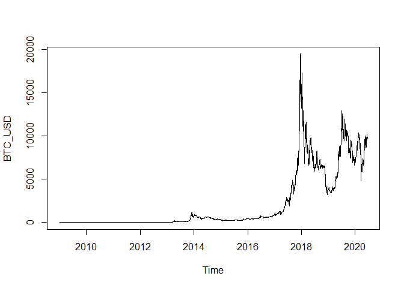
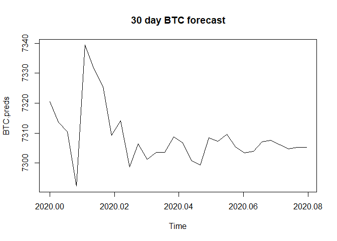

Time Series Project - Multivariate Analysis
================
Jainam Mehta
02 June 2020

Import necessary libraries

``` r
library(tseries)
library(forecast)
library(tidyverse)
library(MTS)
library(imputeTS)
library(TSA)
library(lubridate)
library(vars)
```

## Data Prep

Download various datasets from Quandl

  - BTC Market price
    (<https://www.quandl.com/data/BCHAIN/MKPRU-Bitcoin-Market-Price-USD>)
  - ETH to USD rate
    (<https://www.quandl.com/data/GDAX/ETH_USD-ETH-USD-Exchange-Rate>)
  - LTC to USD rate
    (<https://www.quandl.com/data/GDAX/LTC_USD-LTC-USD-Exchange-Rate>)
  - ETH to BTC rate
    (<https://www.quandl.com/data/GDAX/ETH_BTC-ETH-BTC-Exchange-Rate>)
  - LTC to BTC rate
    (<https://www.quandl.com/data/GDAX/LTC_BTC-LTC-BTC-Exchange-Rate>)
  - Bitcoin Miners Revenue
    (<https://www.quandl.com/data/BCHAIN/MIREV-Bitcoin-Miners-Revenue>)
  - Number of Transactions
    (<https://www.quandl.com/data/BCHAIN/NTRAN-Bitcoin-Number-of-Transactions>)

<!-- end list -->

``` r
library(Quandl)
Quandl.api_key("UqYbx-p5DwWzyT8AH2c7")

# Select the relevant series
BTC_USD_raw<-Quandl("BCHAIN/MKPRU")
ETH_USD_raw<-Quandl("GDAX/ETH_USD")
LTC_USD_raw<-Quandl("GDAX/LTC_USD")
ETH_BTC_raw<-Quandl("GDAX/ETH_BTC")
LTC_BTC_raw<-Quandl("GDAX/LTC_BTC")

# Select non-price predictors
MIREV_raw<-Quandl("BCHAIN/MIREV")
NTRAN_raw<-Quandl("BCHAIN/NTRAN")
```

Create a function to convert the data into proper time series objects.
This function reverses the time series so that it is chrononlogical and
then assigns it to a time series object with the correct start date.

``` r
create_ts <- function(rawdata) {
  # use opening price, if Value column doesn't exist
  if (!"Value" %in% colnames(rawdata)) {rawdata$Value <- rawdata$Open} 
  
  rawdata$Date <- as.Date(rawdata$Date)
  # fill missing dates with NA.
  rawdata <- complete(rawdata, Date = seq(min(Date), max(Date), by = "day")) 
  #year <- as.numeric(format(rawdata$Date,'%Y'))[1]
  #month <- as.numeric(format(rawdata$Date,'%m'))[1]
  #day <- as.numeric(format(rawdata$Date,'%d'))[1]
  
  return(ts(rawdata$Value, decimal_date(as.Date(rawdata$Date[1])), frequency = 365))
}
```

Create time series objects for all data

``` r
BTC_USD <- create_ts(BTC_USD_raw)
plot(BTC_USD)
```

<!-- -->

``` r
ETH_USD <- create_ts(ETH_USD_raw)
plot(ETH_USD)
```

<!-- -->

``` r
LTC_USD <- create_ts(LTC_USD_raw)
plot(LTC_USD)
```

<!-- -->

``` r
ETH_BTC <- create_ts(ETH_BTC_raw)
plot(ETH_BTC)
```

<!-- -->

``` r
LTC_BTC <- create_ts(LTC_BTC_raw)
plot(LTC_BTC)
```

<!-- -->

``` r
MIREV <- create_ts(MIREV_raw)
plot(MIREV)
```

<!-- -->

``` r
NTRAN <- create_ts(NTRAN_raw)
plot(NTRAN)
```

<!-- -->

Function to create imputed series

``` r
series_names <- list(BTC_USD, ETH_USD, LTC_USD, ETH_BTC, LTC_BTC, MIREV, NTRAN)
train <- matrix()
test <- matrix()

for (i in series_names) {
  imputed <- na_interpolation(i, option = 'linear')
  plotNA.imputations(i, imputed)
  tr <- window(imputed, start = 2018, end = 2019)
  plot(tr)
  te <- window(imputed, start = 2020, end = c(2020, 90))
  plot(te)
  test <- cbind(test, te)
}
```

<!-- --><!-- --><!-- --><!-- --><!-- --><!-- --><!-- --><!-- --><!-- --><!-- --><!-- --><!-- --><!-- --><!-- --><!-- --><!-- --><!-- --><!-- --><!-- --><!-- --><!-- -->

Manually created imputed series for ETH\_USD and LTC\_USD

``` r
ETH_USD.imp <- na_interpolation(ETH_USD, option = 'spline')
plotNA.imputations(ETH_USD, ETH_USD.imp)
```

<!-- -->

``` r
LTC_USD.imp <- na_interpolation(LTC_USD, option = 'spline')
plotNA.imputations(LTC_USD, LTC_USD.imp)
```

<!-- -->

Create train and test splits for each

``` r
BTC_USD.train <- window(BTC_USD, start = 2018, end = 2020)
MIREV.train <- window(MIREV, start = 2018, end = 2020)
NTRAN.train <- window(NTRAN, start = 2018, end = 2020)
ETH_USD.train <- window(ETH_USD.imp, start = 2018, end = 2020)
LTC_USD.train <- window(LTC_USD.imp, start = 2018, end = 2020)

BTC_USD.test <- window(BTC_USD, start = 2020, end = c(2020, 90))
MIREV.test <- window(MIREV, start = 2020, end = c(2020, 90))
NTRAN.test <- window(NTRAN, start = 2020, end = c(2020, 90))
ETH_USD.test <- window(ETH_USD.imp, start = 2020, end = c(2020, 90))
LTC_USD.test <- window(LTC_USD.imp, start = 2020, end = c(2020, 90))

plot(BTC_USD.train, main = 'Train')
```

<!-- -->

``` r
plot(BTC_USD.test, main = 'Test')
```

<!-- -->

# Multivariate Analysis

Select the 3 series of the market prices of BTC, ETH and LTC.

``` r
cryptos <- na.omit(cbind(BTC_USD.train, ETH_USD.train, LTC_USD.train))
head(cryptos)
```

    ## Time Series:
    ## Start = c(2018, 2) 
    ## End = c(2018, 7) 
    ## Frequency = 365 
    ##          BTC_USD.train ETH_USD.train LTC_USD.train
    ## 2018.003      13215.57        743.01        227.12
    ## 2018.005      14165.58        754.39        252.20
    ## 2018.008      13812.19        860.00        243.11
    ## 2018.011      15005.86        942.01        235.89
    ## 2018.014      15053.26        948.04        246.00
    ## 2018.016      15199.35        953.44        281.26

``` r
plot(cryptos)
```

<!-- -->

``` r
cor(cryptos)
```

    ##               BTC_USD.train ETH_USD.train LTC_USD.train
    ## BTC_USD.train     1.0000000     0.5909493     0.7043288
    ## ETH_USD.train     0.5909493     1.0000000     0.8952932
    ## LTC_USD.train     0.7043288     0.8952932     1.0000000

Not that the series are all quite correlated as expected.

Run tests for stationarity.

``` r
apply(cryptos, 2, adf.test)
```

    ## $BTC_USD.train
    ## 
    ##  Augmented Dickey-Fuller Test
    ## 
    ## data:  newX[, i]
    ## Dickey-Fuller = -3.8149, Lag order = 8, p-value = 0.01825
    ## alternative hypothesis: stationary
    ## 
    ## 
    ## $ETH_USD.train
    ## 
    ##  Augmented Dickey-Fuller Test
    ## 
    ## data:  newX[, i]
    ## Dickey-Fuller = -2.614, Lag order = 8, p-value = 0.3184
    ## alternative hypothesis: stationary
    ## 
    ## 
    ## $LTC_USD.train
    ## 
    ##  Augmented Dickey-Fuller Test
    ## 
    ## data:  newX[, i]
    ## Dickey-Fuller = -3.0801, Lag order = 8, p-value = 0.1211
    ## alternative hypothesis: stationary

``` r
apply(cryptos, 2, kpss.test)
```

    ## Warning in FUN(newX[, i], ...): p-value smaller than printed p-value
    
    ## Warning in FUN(newX[, i], ...): p-value smaller than printed p-value
    
    ## Warning in FUN(newX[, i], ...): p-value smaller than printed p-value

    ## $BTC_USD.train
    ## 
    ##  KPSS Test for Level Stationarity
    ## 
    ## data:  newX[, i]
    ## KPSS Level = 1.7156, Truncation lag parameter = 6, p-value = 0.01
    ## 
    ## 
    ## $ETH_USD.train
    ## 
    ##  KPSS Test for Level Stationarity
    ## 
    ## data:  newX[, i]
    ## KPSS Level = 6.427, Truncation lag parameter = 6, p-value = 0.01
    ## 
    ## 
    ## $LTC_USD.train
    ## 
    ##  KPSS Test for Level Stationarity
    ## 
    ## data:  newX[, i]
    ## KPSS Level = 4.2797, Truncation lag parameter = 6, p-value = 0.01

Since the series are all non-stationary, we take first differences

``` r
cryptos.stnry <- diffM(cryptos)

# Run stationarity tests to check now
apply(cryptos.stnry, 2, adf.test)
```

    ## Warning in FUN(newX[, i], ...): p-value smaller than printed p-value
    
    ## Warning in FUN(newX[, i], ...): p-value smaller than printed p-value
    
    ## Warning in FUN(newX[, i], ...): p-value smaller than printed p-value

    ## $BTC_USD.train
    ## 
    ##  Augmented Dickey-Fuller Test
    ## 
    ## data:  newX[, i]
    ## Dickey-Fuller = -9.5334, Lag order = 8, p-value = 0.01
    ## alternative hypothesis: stationary
    ## 
    ## 
    ## $ETH_USD.train
    ## 
    ##  Augmented Dickey-Fuller Test
    ## 
    ## data:  newX[, i]
    ## Dickey-Fuller = -12.622, Lag order = 8, p-value = 0.01
    ## alternative hypothesis: stationary
    ## 
    ## 
    ## $LTC_USD.train
    ## 
    ##  Augmented Dickey-Fuller Test
    ## 
    ## data:  newX[, i]
    ## Dickey-Fuller = -9.9324, Lag order = 8, p-value = 0.01
    ## alternative hypothesis: stationary

``` r
#apply(cryptos.stnry, 2, kpss.test)
```

Plot the differenced series

``` r
plot.ts(cryptos.stnry)
```

<!-- -->

Identify the Lag orders. We will use two different functions, from two
different packages to identify the lag order for the VAR model. Both
functions are quite similar to each other but differ in the output they
produce. vars::VAR is a more powerful and convinient function to
identify the correct lag order.

``` r
VARselect(cryptos.stnry, 
          type = "none", #type of deterministic regressors to include. We use none becasue the time series was made stationary using differencing above. 
          lag.max = 10) #highest lag order
```

    ## $selection
    ## AIC(n)  HQ(n)  SC(n) FPE(n) 
    ##     10      8      7     10 
    ## 
    ## $criteria
    ##                   1            2            3            4            5
    ## AIC(n) 1.985181e+01 1.976801e+01 1.960002e+01 1.952909e+01 1.946716e+01
    ## HQ(n)  1.987396e+01 1.981231e+01 1.966647e+01 1.961769e+01 1.957791e+01
    ## SC(n)  1.990918e+01 1.988274e+01 1.977212e+01 1.975855e+01 1.975399e+01
    ## FPE(n) 4.183431e+08 3.847135e+08 3.252246e+08 3.029574e+08 2.847662e+08
    ##                   6            7            8            9           10
    ## AIC(n) 1.940861e+01 1.932315e+01 1.927616e+01 1.926366e+01 1.923372e+01
    ## HQ(n)  1.954150e+01 1.947819e+01 1.945335e+01 1.946301e+01 1.945521e+01
    ## SC(n)  1.975280e+01 1.972471e+01 1.973508e+01 1.977995e+01 1.980737e+01
    ## FPE(n) 2.685745e+08 2.465806e+08 2.352683e+08 2.323535e+08 2.255072e+08

Creating a VAR model with vars

``` r
var.a <- vars::VAR(cryptos.stnry,
                   lag.max = 10, #highest lag order for lag length selection according to the choosen ic
                   ic = "AIC", #information criterion
                   type = "none") #type of deterministic regressors to include
summary(var.a)
```

    ## 
    ## VAR Estimation Results:
    ## ========================= 
    ## Endogenous variables: BTC_USD.train, ETH_USD.train, LTC_USD.train 
    ## Deterministic variables: none 
    ## Sample size: 718 
    ## Log Likelihood: -9871.298 
    ## Roots of the characteristic polynomial:
    ## 0.9003 0.9003 0.8926 0.8926 0.8866 0.8866 0.8659 0.8659 0.853 0.8425 0.8425 0.8331 0.8331 0.8242 0.8242 0.8106 0.8106 0.8084 0.8084 0.786 0.786 0.7567 0.7567 0.6465 0.6465 0.6399 0.6399 0.5034 0.5019 0.5019
    ## Call:
    ## vars::VAR(y = cryptos.stnry, type = "none", lag.max = 10, ic = "AIC")
    ## 
    ## 
    ## Estimation results for equation BTC_USD.train: 
    ## ============================================== 
    ## BTC_USD.train = BTC_USD.train.l1 + ETH_USD.train.l1 + LTC_USD.train.l1 + BTC_USD.train.l2 + ETH_USD.train.l2 + LTC_USD.train.l2 + BTC_USD.train.l3 + ETH_USD.train.l3 + LTC_USD.train.l3 + BTC_USD.train.l4 + ETH_USD.train.l4 + LTC_USD.train.l4 + BTC_USD.train.l5 + ETH_USD.train.l5 + LTC_USD.train.l5 + BTC_USD.train.l6 + ETH_USD.train.l6 + LTC_USD.train.l6 + BTC_USD.train.l7 + ETH_USD.train.l7 + LTC_USD.train.l7 + BTC_USD.train.l8 + ETH_USD.train.l8 + LTC_USD.train.l8 + BTC_USD.train.l9 + ETH_USD.train.l9 + LTC_USD.train.l9 + BTC_USD.train.l10 + ETH_USD.train.l10 + LTC_USD.train.l10 
    ## 
    ##                    Estimate Std. Error t value Pr(>|t|)    
    ## BTC_USD.train.l1  -0.193006   0.037552  -5.140 3.59e-07 ***
    ## ETH_USD.train.l1   4.523743   0.745365   6.069 2.12e-09 ***
    ## LTC_USD.train.l1  -0.193593   2.634707  -0.073 0.941447    
    ## BTC_USD.train.l2  -0.072182   0.036908  -1.956 0.050902 .  
    ## ETH_USD.train.l2   3.371094   0.771349   4.370 1.43e-05 ***
    ## LTC_USD.train.l2  16.861094   3.491493   4.829 1.69e-06 ***
    ## BTC_USD.train.l3   0.011078   0.036604   0.303 0.762257    
    ## ETH_USD.train.l3  -1.755561   0.804730  -2.182 0.029480 *  
    ## LTC_USD.train.l3  -2.528033   3.653588  -0.692 0.489214    
    ## BTC_USD.train.l4  -0.010051   0.036472  -0.276 0.782948    
    ## ETH_USD.train.l4   0.022406   0.762952   0.029 0.976580    
    ## LTC_USD.train.l4  14.432904   3.869088   3.730 0.000207 ***
    ## BTC_USD.train.l5  -0.008407   0.035954  -0.234 0.815181    
    ## ETH_USD.train.l5  -2.185292   0.751226  -2.909 0.003743 ** 
    ## LTC_USD.train.l5   4.077272   3.854826   1.058 0.290561    
    ## BTC_USD.train.l6  -0.042581   0.035930  -1.185 0.236381    
    ## ETH_USD.train.l6   0.213398   0.755145   0.283 0.777575    
    ## LTC_USD.train.l6   3.058727   3.546512   0.862 0.388734    
    ## BTC_USD.train.l7   0.038068   0.035792   1.064 0.287888    
    ## ETH_USD.train.l7   1.117416   0.766009   1.459 0.145090    
    ## LTC_USD.train.l7   7.529061   3.490661   2.157 0.031358 *  
    ## BTC_USD.train.l8  -0.064928   0.036305  -1.788 0.074152 .  
    ## ETH_USD.train.l8  -1.695957   0.721044  -2.352 0.018949 *  
    ## LTC_USD.train.l8   0.732537   3.503617   0.209 0.834448    
    ## BTC_USD.train.l9  -0.095408   0.035132  -2.716 0.006779 ** 
    ## ETH_USD.train.l9   1.030815   0.711111   1.450 0.147630    
    ## LTC_USD.train.l9   4.243841   3.384611   1.254 0.210317    
    ## BTC_USD.train.l10  0.055628   0.030229   1.840 0.066167 .  
    ## ETH_USD.train.l10 -0.747874   0.582362  -1.284 0.199501    
    ## LTC_USD.train.l10  2.038664   3.204553   0.636 0.524872    
    ## ---
    ## Signif. codes:  0 '***' 0.001 '**' 0.01 '*' 0.05 '.' 0.1 ' ' 1
    ## 
    ## 
    ## Residual standard error: 270.4 on 688 degrees of freedom
    ## Multiple R-Squared: 0.4171,  Adjusted R-squared: 0.3917 
    ## F-statistic: 16.41 on 30 and 688 DF,  p-value: < 2.2e-16 
    ## 
    ## 
    ## Estimation results for equation ETH_USD.train: 
    ## ============================================== 
    ## ETH_USD.train = BTC_USD.train.l1 + ETH_USD.train.l1 + LTC_USD.train.l1 + BTC_USD.train.l2 + ETH_USD.train.l2 + LTC_USD.train.l2 + BTC_USD.train.l3 + ETH_USD.train.l3 + LTC_USD.train.l3 + BTC_USD.train.l4 + ETH_USD.train.l4 + LTC_USD.train.l4 + BTC_USD.train.l5 + ETH_USD.train.l5 + LTC_USD.train.l5 + BTC_USD.train.l6 + ETH_USD.train.l6 + LTC_USD.train.l6 + BTC_USD.train.l7 + ETH_USD.train.l7 + LTC_USD.train.l7 + BTC_USD.train.l8 + ETH_USD.train.l8 + LTC_USD.train.l8 + BTC_USD.train.l9 + ETH_USD.train.l9 + LTC_USD.train.l9 + BTC_USD.train.l10 + ETH_USD.train.l10 + LTC_USD.train.l10 
    ## 
    ##                     Estimate Std. Error t value Pr(>|t|)    
    ## BTC_USD.train.l1  -0.0001122  0.0019095  -0.059 0.953174    
    ## ETH_USD.train.l1   0.3142509  0.0379013   8.291 5.88e-16 ***
    ## LTC_USD.train.l1   2.9777840  0.1339730  22.227  < 2e-16 ***
    ## BTC_USD.train.l2   0.0007835  0.0018768   0.417 0.676470    
    ## ETH_USD.train.l2  -0.3033455  0.0392225  -7.734 3.71e-14 ***
    ## LTC_USD.train.l2  -1.3016098  0.1775399  -7.331 6.42e-13 ***
    ## BTC_USD.train.l3   0.0043560  0.0018613   2.340 0.019553 *  
    ## ETH_USD.train.l3   0.2895569  0.0409199   7.076 3.66e-12 ***
    ## LTC_USD.train.l3   1.4838883  0.1857823   7.987 5.81e-15 ***
    ## BTC_USD.train.l4  -0.0019217  0.0018546  -1.036 0.300476    
    ## ETH_USD.train.l4  -0.2594431  0.0387955  -6.687 4.70e-11 ***
    ## LTC_USD.train.l4  -0.9103846  0.1967403  -4.627 4.43e-06 ***
    ## BTC_USD.train.l5  -0.0029159  0.0018282  -1.595 0.111183    
    ## ETH_USD.train.l5   0.1327223  0.0381993   3.474 0.000544 ***
    ## LTC_USD.train.l5   0.6164247  0.1960151   3.145 0.001734 ** 
    ## BTC_USD.train.l6   0.0015197  0.0018270   0.832 0.405825    
    ## ETH_USD.train.l6   0.0378479  0.0383986   0.986 0.324647    
    ## LTC_USD.train.l6  -0.4172513  0.1803376  -2.314 0.020977 *  
    ## BTC_USD.train.l7   0.0103145  0.0018200   5.667 2.13e-08 ***
    ## ETH_USD.train.l7  -0.0565941  0.0389510  -1.453 0.146692    
    ## LTC_USD.train.l7   0.1451910  0.1774976   0.818 0.413647    
    ## BTC_USD.train.l8   0.0021248  0.0018461   1.151 0.250138    
    ## ETH_USD.train.l8  -0.1846894  0.0366646  -5.037 6.04e-07 ***
    ## LTC_USD.train.l8   0.2246907  0.1781564   1.261 0.207664    
    ## BTC_USD.train.l9   0.0033055  0.0017864   1.850 0.064692 .  
    ## ETH_USD.train.l9   0.0960278  0.0361595   2.656 0.008098 ** 
    ## LTC_USD.train.l9   0.2299369  0.1721050   1.336 0.181982    
    ## BTC_USD.train.l10 -0.0015744  0.0015371  -1.024 0.306084    
    ## ETH_USD.train.l10  0.0076347  0.0296127   0.258 0.796623    
    ## LTC_USD.train.l10 -0.6116397  0.1629492  -3.754 0.000189 ***
    ## ---
    ## Signif. codes:  0 '***' 0.001 '**' 0.01 '*' 0.05 '.' 0.1 ' ' 1
    ## 
    ## 
    ## Residual standard error: 13.75 on 688 degrees of freedom
    ## Multiple R-Squared: 0.6412,  Adjusted R-squared: 0.6255 
    ## F-statistic: 40.98 on 30 and 688 DF,  p-value: < 2.2e-16 
    ## 
    ## 
    ## Estimation results for equation LTC_USD.train: 
    ## ============================================== 
    ## LTC_USD.train = BTC_USD.train.l1 + ETH_USD.train.l1 + LTC_USD.train.l1 + BTC_USD.train.l2 + ETH_USD.train.l2 + LTC_USD.train.l2 + BTC_USD.train.l3 + ETH_USD.train.l3 + LTC_USD.train.l3 + BTC_USD.train.l4 + ETH_USD.train.l4 + LTC_USD.train.l4 + BTC_USD.train.l5 + ETH_USD.train.l5 + LTC_USD.train.l5 + BTC_USD.train.l6 + ETH_USD.train.l6 + LTC_USD.train.l6 + BTC_USD.train.l7 + ETH_USD.train.l7 + LTC_USD.train.l7 + BTC_USD.train.l8 + ETH_USD.train.l8 + LTC_USD.train.l8 + BTC_USD.train.l9 + ETH_USD.train.l9 + LTC_USD.train.l9 + BTC_USD.train.l10 + ETH_USD.train.l10 + LTC_USD.train.l10 
    ## 
    ##                     Estimate Std. Error t value Pr(>|t|)    
    ## BTC_USD.train.l1  -2.804e-04  5.307e-04  -0.528  0.59743    
    ## ETH_USD.train.l1  -2.807e-02  1.053e-02  -2.664  0.00789 ** 
    ## LTC_USD.train.l1   3.438e-01  3.724e-02   9.232  < 2e-16 ***
    ## BTC_USD.train.l2  -1.307e-03  5.217e-04  -2.506  0.01243 *  
    ## ETH_USD.train.l2   3.091e-02  1.090e-02   2.835  0.00471 ** 
    ## LTC_USD.train.l2   1.019e-01  4.935e-02   2.064  0.03936 *  
    ## BTC_USD.train.l3   2.249e-05  5.173e-04   0.043  0.96534    
    ## ETH_USD.train.l3   2.287e-02  1.137e-02   2.011  0.04471 *  
    ## LTC_USD.train.l3  -2.835e-01  5.164e-02  -5.489 5.68e-08 ***
    ## BTC_USD.train.l4   6.601e-04  5.155e-04   1.281  0.20075    
    ## ETH_USD.train.l4  -1.904e-02  1.078e-02  -1.765  0.07797 .  
    ## LTC_USD.train.l4   8.387e-02  5.468e-02   1.534  0.12555    
    ## BTC_USD.train.l5   1.591e-03  5.082e-04   3.131  0.00182 ** 
    ## ETH_USD.train.l5   1.043e-02  1.062e-02   0.983  0.32620    
    ## LTC_USD.train.l5   8.329e-02  5.448e-02   1.529  0.12678    
    ## BTC_USD.train.l6   1.407e-03  5.078e-04   2.770  0.00575 ** 
    ## ETH_USD.train.l6  -8.402e-02  1.067e-02  -7.872 1.36e-14 ***
    ## LTC_USD.train.l6  -6.095e-02  5.013e-02  -1.216  0.22440    
    ## BTC_USD.train.l7  -3.727e-04  5.059e-04  -0.737  0.46159    
    ## ETH_USD.train.l7   2.584e-02  1.083e-02   2.387  0.01725 *  
    ## LTC_USD.train.l7   2.631e-01  4.934e-02   5.332 1.32e-07 ***
    ## BTC_USD.train.l8   2.306e-04  5.131e-04   0.449  0.65328    
    ## ETH_USD.train.l8  -4.592e-02  1.019e-02  -4.506 7.76e-06 ***
    ## LTC_USD.train.l8  -1.399e-01  4.952e-02  -2.826  0.00485 ** 
    ## BTC_USD.train.l9   1.013e-04  4.965e-04   0.204  0.83848    
    ## ETH_USD.train.l9   3.596e-02  1.005e-02   3.578  0.00037 ***
    ## LTC_USD.train.l9   1.050e-01  4.784e-02   2.196  0.02843 *  
    ## BTC_USD.train.l10  3.179e-04  4.273e-04   0.744  0.45704    
    ## ETH_USD.train.l10  2.083e-03  8.231e-03   0.253  0.80027    
    ## LTC_USD.train.l10 -2.040e-01  4.529e-02  -4.503 7.87e-06 ***
    ## ---
    ## Signif. codes:  0 '***' 0.001 '**' 0.01 '*' 0.05 '.' 0.1 ' ' 1
    ## 
    ## 
    ## Residual standard error: 3.822 on 688 degrees of freedom
    ## Multiple R-Squared: 0.3223,  Adjusted R-squared: 0.2927 
    ## F-statistic:  10.9 on 30 and 688 DF,  p-value: < 2.2e-16 
    ## 
    ## 
    ## 
    ## Covariance matrix of residuals:
    ##               BTC_USD.train ETH_USD.train LTC_USD.train
    ## BTC_USD.train      73051.99      -146.819       -55.557
    ## ETH_USD.train       -146.82       188.782         4.453
    ## LTC_USD.train        -55.56         4.453        14.562
    ## 
    ## Correlation matrix of residuals:
    ##               BTC_USD.train ETH_USD.train LTC_USD.train
    ## BTC_USD.train       1.00000      -0.03954      -0.05387
    ## ETH_USD.train      -0.03954       1.00000       0.08493
    ## LTC_USD.train      -0.05387       0.08493       1.00000

Residual diagnostics

``` r
#serial.test function takes the VAR model as the input.  
serial.test(var.a)
```

    ## 
    ##  Portmanteau Test (asymptotic)
    ## 
    ## data:  Residuals of VAR object var.a
    ## Chi-squared = 195.21, df = 54, p-value < 2.2e-16

Run Granger test for causality. We want to check if ETH and LTC prices
do indeed affect BTC or not

``` r
# for causality function to give reliable results we need all the variables of the multivariate time series to be stationary. 
causality(var.a, cause = c("ETH_USD.train", "LTC_USD.train")) #cause variable
```

    ## $Granger
    ## 
    ##  Granger causality H0: ETH_USD.train LTC_USD.train do not Granger-cause
    ##  BTC_USD.train
    ## 
    ## data:  VAR object var.a
    ## F-Test = 22.92, df1 = 20, df2 = 2064, p-value < 2.2e-16
    ## 
    ## 
    ## $Instant
    ## 
    ##  H0: No instantaneous causality between: ETH_USD.train LTC_USD.train
    ##  and BTC_USD.train
    ## 
    ## data:  VAR object var.a
    ## Chi-squared = 3.1034, df = 2, p-value = 0.2119

We reject the null hypothesis and therefore show that ETH and LTC do
cause BTC.

Forecasting with the VAR model

``` r
fcast = predict(var.a, n.ahead = 30) # we forecast over a short horizon because beyond short horizon prediction becomes unreliable or uniform
par(mar = c(2.5,2.5,2.5,2.5))
plot(fcast)
```

<!-- -->

Extracting the BTC forecast

``` r
# Forecasting the DAX index
BTC.fcast = fcast$fcst[1]
head(BTC.fcast)
```

    ## $BTC_USD.train
    ##              fcst     lower    upper       CI
    ##  [1,]  64.8555293 -465.0924 594.8035 529.9480
    ##  [2,]  20.2786374 -533.9167 574.4740 554.1953
    ##  [3,]   4.3994009 -607.9588 616.7576 612.3582
    ##  [4,] -10.5043398 -634.3442 613.3355 623.8399
    ##  [5,]  34.0953892 -596.6348 664.8255 630.7301
    ##  [6,] -16.4393226 -648.3031 615.4245 631.8638
    ##  [7,] -12.8171114 -647.3142 621.6800 634.4971
    ##  [8,] -12.7781912 -656.7368 631.1804 643.9586
    ##  [9,]  11.4392528 -642.2454 665.1239 653.6846
    ## [10,] -17.3558566 -673.2139 638.5022 655.8580
    ## [11,]   1.3954223 -658.5989 661.3898 659.9944
    ## [12,]  -9.2622129 -672.2305 653.7061 662.9683
    ## [13,]   2.8614540 -662.2374 667.9603 665.0988
    ## [14,]   5.2606091 -661.5568 672.0780 666.8174
    ## [15,]   6.9946828 -660.3213 674.3107 667.3160
    ## [16,]  -1.1171774 -669.0219 666.7875 667.9047
    ## [17,] -10.0278089 -678.4779 658.4222 668.4501
    ## [18,]  -2.3208931 -671.8729 667.2312 669.5521
    ## [19,]   9.4398990 -660.2683 679.1481 669.7082
    ## [20,]  -0.1954952 -670.0295 669.6385 669.8340
    ## [21,]   2.3456844 -667.6236 672.3150 669.9693
    ## [22,]  -4.5193511 -674.5281 665.4894 670.0088
    ## [23,]  -2.4582814 -672.6936 667.7770 670.2353
    ## [24,]   0.2216549 -670.0237 670.4671 670.2454
    ## [25,]   2.5882909 -667.7319 672.9084 670.3201
    ## [26,]   0.8943731 -669.4492 671.2379 670.3435
    ## [27,]  -1.3051792 -671.6812 669.0709 670.3760
    ## [28,]  -0.3141737 -670.6964 670.0680 670.3822
    ## [29,]   0.9164377 -669.4986 671.3315 670.4150
    ## [30,]  -0.4512024 -670.8734 669.9710 670.4222

``` r
BTC.preds <- BTC.fcast$BTC_USD.train[,1]; # extract just the predictions
BTC.preds # one month predictions
```

    ##  [1]  64.8555293  20.2786374   4.3994009 -10.5043398  34.0953892 -16.4393226
    ##  [7] -12.8171114 -12.7781912  11.4392528 -17.3558566   1.3954223  -9.2622129
    ## [13]   2.8614540   5.2606091   6.9946828  -1.1171774 -10.0278089  -2.3208931
    ## [19]   9.4398990  -0.1954952   2.3456844  -4.5193511  -2.4582814   0.2216549
    ## [25]   2.5882909   0.8943731  -1.3051792  -0.3141737   0.9164377  -0.4512024

To get the data to the original scale we need to invert the time series

``` r
#since the values are just difference from the previous value, to get the values on the original scale we add the last value from the BTC time series to the predicted values.
tail(cryptos)[6,1]
```

    ## BTC_USD.train 
    ##       7243.93

``` r
BTC.preds = cumsum(BTC.preds) + as.numeric(tail(cryptos)[6,1])
BTC.preds = ts(BTC.preds, start = c(2020, 1), frequency = 365)
plot(BTC.preds, main = "30 day BTC forecast")
```

<!-- -->

Plot the forecast alongside the actual values

``` r
par(mar = c(2.5,2.5,1,2.5)) #bottom, left, top, and right
plot(BTC.preds, main = "30 day BTC forecast", col = 'red', lwd = 2, ylim = c(7000, 9000))
lines(index(BTC.preds), window(BTC_USD.test, end=c(2020, 30)), col = 'black', lwd = 2)
```

<!-- -->

## VARMA() method from class

Run a multivariate model using VARMA().

``` r
m1 <- VARMA(cryptos)
```

    ## Number of parameters:  12 
    ## initial estimates:  108.3028 3.9818 1.5063 0.9653 -0.4297 3.2461 -0.0017 0.9495 0.2751 -3e-04 -0.0036 1.0157 
    ## Par. lower-bounds:  26.2226 -1.2388 0.4211 0.9513 -0.6521 1.9391 -0.0026 0.9353 0.1919 -4e-04 -0.0066 0.9984 
    ## Par. upper-bounds:  190.383 9.2024 2.5915 0.9794 -0.2072 4.5531 -8e-04 0.9636 0.3582 -1e-04 -7e-04 1.033 
    ## Final   Estimates:  108.3028 3.981776 1.506278 0.9653414 -0.4296607 3.246096 -0.001526813 0.9494914 0.275076 -0.0002622938 -0.003649397 1.015681 
    ## 
    ## Coefficient(s):
    ##                 Estimate  Std. Error  t value Pr(>|t|)    
    ## BTC_USD.train  1.083e+02   4.088e+01    2.649 0.008072 ** 
    ## ETH_USD.train  3.982e+00   2.660e+00    1.497 0.134393    
    ## LTC_USD.train  1.506e+00   5.682e-01    2.651 0.008027 ** 
    ## BTC_USD.train  9.653e-01   7.209e-03  133.916  < 2e-16 ***
    ## ETH_USD.train -4.297e-01   1.135e-01   -3.786 0.000153 ***
    ## LTC_USD.train  3.246e+00   6.598e-01    4.920 8.65e-07 ***
    ## BTC_USD.train -1.527e-03   4.676e-04   -3.265 0.001093 ** 
    ## ETH_USD.train  9.495e-01   7.359e-03  129.016  < 2e-16 ***
    ## LTC_USD.train  2.751e-01   4.280e-02    6.427 1.30e-10 ***
    ## BTC_USD.train -2.623e-04   1.002e-04   -2.618 0.008840 ** 
    ## ETH_USD.train -3.649e-03   1.577e-03   -2.315 0.020633 *  
    ## LTC_USD.train  1.016e+00   9.163e-03  110.851  < 2e-16 ***
    ## ---
    ## Signif. codes:  0 '***' 0.001 '**' 0.01 '*' 0.05 '.' 0.1 ' ' 1
    ## --- 
    ## Estimates in matrix form: 
    ## Constant term:  
    ## Estimates:  108.3028 3.981776 1.506278 
    ## AR coefficient matrix 
    ## AR( 1 )-matrix 
    ##           [,1]     [,2]  [,3]
    ## [1,]  0.965341 -0.42966 3.246
    ## [2,] -0.001527  0.94949 0.275
    ## [3,] -0.000262 -0.00365 1.016
    ##   
    ## Residuals cov-matrix: 
    ##              [,1]       [,2]      [,3]
    ## [1,] 123675.26026 -151.14228 -80.63496
    ## [2,]   -151.14228  520.15773  13.52855
    ## [3,]    -80.63496   13.52855  23.89123
    ## ---- 
    ## aic=  21.16876 
    ## bic=  21.24435

``` r
summary(m1)
```

    ##           Length Class  Mode   
    ## data      2187   mts    numeric
    ## ARorder      1   -none- numeric
    ## MAorder      1   -none- numeric
    ## cnst         1   -none- logical
    ## coef        12   -none- numeric
    ## secoef      12   -none- numeric
    ## residuals 2184   -none- numeric
    ## Sigma        9   -none- numeric
    ## aic          1   -none- numeric
    ## bic          1   -none- numeric
    ## Phi          9   -none- numeric
    ## Theta        0   -none- NULL   
    ## Ph0          3   -none- numeric

``` r
acf(resid(m1))
```

<!-- -->

References:
<https://bookdown.org/singh_pratap_tejendra/intro_time_series_r/multivariate-ts-analysis.html>
